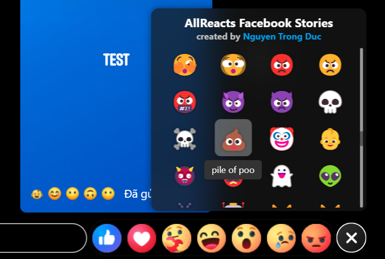
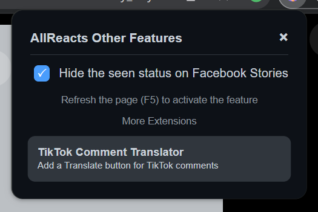

# AllReacts for Facebook Stories
AllReacts is a browser extension that lets you react to Facebook Stories with any emoji, going beyond the default reactions. With it, you can express yourself more creatively when interacting with friends' Stories.

## Features

- **React with any emoji on Stories**: No longer limited to Facebook's default emojis, you can choose and react with any emoji you like on Stories.
- **Unseen Facebook Stories**: View Facebook Stories without showing up as "seen," so others won’t know you've viewed their stories.
- **Simple and easy-to-use interface**: The extension has a user-friendly interface for quick and easy interaction.

## Installation

1. **Clone** the repository (or Download ZIP):
    ```bash
    git clone https://github.com/DuckCIT/AllReacts-for-Facebook-Stories.git
    ```
2. **Load the extension** on your browser:
   - Go to `chrome://extensions/` on Chrome or `edge://extensions/` on Edge.
   - Enable **Developer mode**.
   - Select **Load unpacked** and choose the project folder.

3. **Launch** the extension: Once installed, the AllReacts Facebook icon will appear on your browser toolbar.

## How to Use

1. Open the Facebook Stories you want to react to.
2. Click the 'Plus' icon in the bottom corner of the reactions footer.
<div align="center">
  
</div>

3. Choose your favorite emoji and react to the Story.

**Hide seen Story**

1. Click the AllReacts for Facebook Stories icon from the Extension.
<div align="center">
  
</div>

3. Enable/Disable 'Hide the seen status on Facebook Stories'.

## Copyright

© 2024 by Nguyen Trong Duc (DuckCIT). All rights reserved. Feel free to build upon this project, but please give credit to the original author. Your respect for the original work is appreciated.

## Contact

If you have any questions or feedback about the project, please reach out via [Contact Page](https://duckcit.me) or leave a comment on GitHub.

## License

This project is licensed under the MIT License. See the [LICENSE](LICENSE) file for details.

---

I hope AllReacts adds a fun and diverse experience to your Facebook interactions!